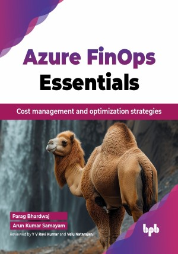

# Azure FinOps Essentials

Cost management and optimization strategies.

This is the repository for [Azure FinOps Essentials
](https://bpbonline.com/products/azure-finops-essentials?variant=44143051800776),published by BPB Publications.

## About the Book
Azure FinOps, the intersection of finance, operations, and technology, has become paramount in optimizing cloud spending. “Azure FinOps Essentials “is a guide to help you navigate easily with cost management and optimization within Microsoft Cloud. 

This book is a practical guide to cutting cloud costs in Microsoft Azure. It covers everything from understanding Azure services and cost management to advanced strategies like Infrastructure as Code and serverless computing. You will learn to set up Azure Cost Management, optimize resources with tools like Reserved Instances, and enforce governance using Azure Policy. The book also highlights case studies and best practices to help you build a FinOps culture, streamline costs, and enhance cost-efficiency in your cloud environment.

If you are new to cloud financial management or need a refresher on some of the best practices, Azure FinOps Essentials is designed for anyone running an operational workload in both public and private clouds who wants to improve their expense management within the environment.

## What You Will Learn
• Establish and enforce standards for Azure cloud cost management through auditing.

• Learn cost-saving tactics like rightsizing and using Reserved Instances.

• Master Azure tools for monitoring spending, budgeting, and setting up alerts.

• Build custom dashboards to accurately display key financial metrics.

• Implement governance and compliance for effective cloud financial management.
